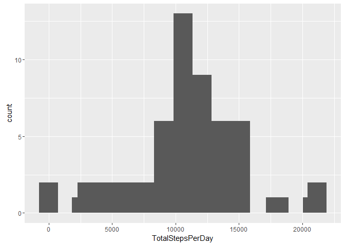
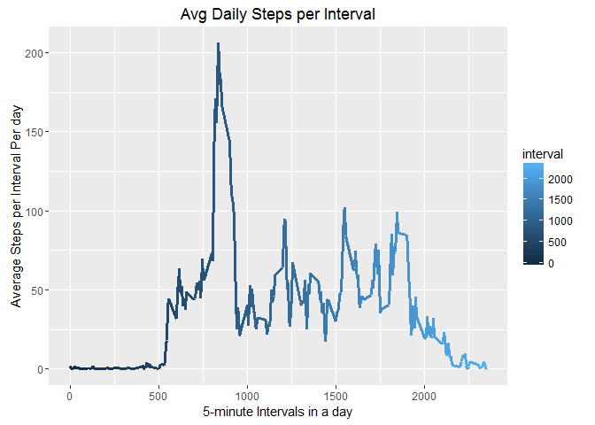
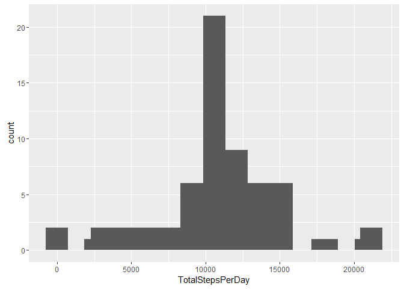
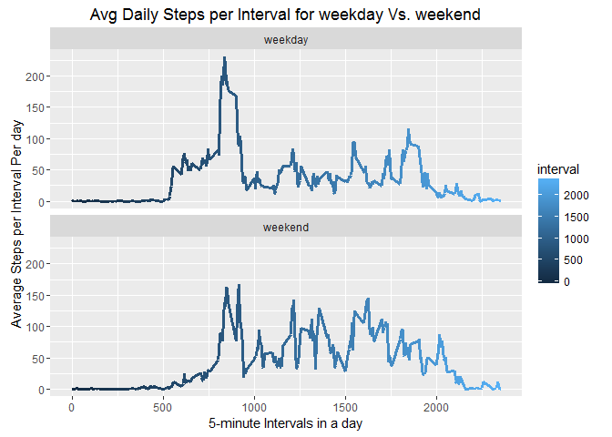

# PA1_template.Rmd
Maulik Patel  
August 25, 2016  


```r
options(warn=-1) #supressing warning globally.
```


```r
suppressMessages(library(ggplot2))
suppressMessages(library(lattice))
suppressMessages(library(plyr))
suppressMessages(library(dplyr))
suppressMessages(library(Hmisc))
suppressMessages(library(reshape2))
suppressMessages(library(tidyr))
suppressMessages(library(statsr))
suppressMessages(library(devtools))
suppressMessages(library(shiny))
```

## Loading and preprocessing the data


```r
setwd("c:\\")
if(!file.exists("./repdata")){dir.create("./repdata")}
url <- "https://d396qusza40orc.cloudfront.net/repdata%2Fdata%2Factivity.zip"
download.file(url, destfile = "./repdata/activity.zip")
unzip("./repdata/activity.zip",exdir = "./repdata")
filepath <- "./repdata/"
setwd("c:\\repdata") 

# Read the above files and create data tables.
activity = read.csv("activity.csv")
act = activity # copy of original data frame
```


```r
# trasnforming the data frame
act$date = as.Date(act$date)

# data frame with no NAs
nonaact = act[!is.na(act$steps),] #2304 NAs excluded, 15264 left
```


## What is mean total number of steps taken per day?


```r
# data preparation
actperday = act %>% group_by(date) %>% summarise(TotalStepsPerDay = sum(steps))
```

### A histogram of the total number of steps taken each day

```r
qplot(TotalStepsPerDay, data=actperday)+stat_bin(bins=15)
```

```
## `stat_bin()` using `bins = 30`. Pick better value with `binwidth`.
```

<!-- -->

### Calculate and report the mean and median total number of steps taken per day.

```r
actperday %>% summarise(Mean=mean(actperday$TotalStepsPerDay, na.rm = TRUE), Median=median(actperday$TotalStepsPerDay, na.rm = TRUE))
```

```
## Source: local data frame [1 x 2]
## 
##       Mean Median
##      (dbl)  (int)
## 1 10766.19  10765
```

```r
# as Median is little bit lower than Mean, it looks like distribution is slightly skewed to the right (positively skewed).
```


## What is the average daily activity pattern?


```r
avgstepsperinterval = act %>% group_by(interval) %>% summarise(AvgStepsPerIntervalPerDay = mean(steps, na.rm=TRUE))
```

### Make a time series plot (i.e. type = "l") of the 5-minute interval (x-axis) and the average number of steps taken, averaged across all days (y-axis)

```r
g1 <- ggplot(data=avgstepsperinterval, aes(x=interval, y=AvgStepsPerIntervalPerDay))

g1 + geom_line(aes(color=interval), lwd=1.1) + labs(title="Avg Daily Steps per Interval") + labs(x = "5-minute Intervals in a day") + labs(y = "Average Steps per Interval Per day") + theme_gray()
```

<!-- -->

```r
# from this plot, we can say that the individual is most active during 800-900 interval, which 8 to 9 AM.
# no. steps/activity slows down after 1900 interval which is around 7pm in the evening. which makes sense as individual is not may be at home.
# activity is flat from 00 to 500 interval which is sleep time for most.(midnight to 5AM).
```

### Which 5-minute interval, on average across all the days in the dataset, contains the maximum number of steps?

```r
avgstepsperinterval[which.max(avgstepsperinterval$AvgStepsPerIntervalPerDay),]
```

```
## Source: local data frame [1 x 2]
## 
##   interval AvgStepsPerIntervalPerDay
##      (int)                     (dbl)
## 1      835                  206.1698
```

```r
# Interval 835 (8:35-8:40 AM) has the maximum no. of steps as 206.17 on average across all the days in the data set.
```


## Imputing missing values

### Calculate and report the total number of missing values in the dataset (i.e. the total number of rows with NAs)


```r
colSums(is.na(act))
```

```
##    steps     date interval 
##     2304        0        0
```

```r
# "steps" column has 2304 missing values. other 2 columns do not have any missing values.
```

### Devise a strategy for filling in all of the missing values in the dataset. The strategy does not need to be sophisticated. For example, you could use the mean/median for that day, or the mean for that 5-minute interval, etc.

```r
# we will use "Average steps per Interval per day" to impute missing values in steps column.
# we already calculated this and results are available for us to use in "avgstepsperinterval" data frame in column 2.
# we will use for loop to impute these values only if steps = NA and by matching for the same interval.
```

### Create a new dataset that is equal to the original dataset but with the missing data filled in.

```r
act2=act

for(i in 1:nrow(act2)) {
        if(is.na(act2[i,1])){
               interval = act2[i,3]
               rownumber = which(avgstepsperinterval[,1]==interval)
               impute = avgstepsperinterval[rownumber,2]
               act2[i,1] = impute
        }
}
# "act2" is a new data frame with imputed missing values. it should not have any missing values now in any column.

head(act2)
```

```
##       steps       date interval
## 1 1.7169811 2012-10-01        0
## 2 0.3396226 2012-10-01        5
## 3 0.1320755 2012-10-01       10
## 4 0.1509434 2012-10-01       15
## 5 0.0754717 2012-10-01       20
## 6 2.0943396 2012-10-01       25
```

```r
colSums(is.na(act2))
```

```
##    steps     date interval 
##        0        0        0
```

```r
# as the table shows, steps column now has "0" missing values which had earlier 2304 missingvalues.
```

### Make a histogram of the total number of steps taken each day and Calculate and report the mean and median total number of steps taken per day. Do these values differ from the estimates from the first part of the assignment? What is the impact of imputing missing data on the estimates of the total daily number of steps?

```r
actperday2 = act2 %>% group_by(date) %>% summarise(TotalStepsPerDay = sum(steps))
```

### a histogram of the total number of steps taken each day.


```r
qplot(TotalStepsPerDay, data=actperday2)+stat_bin(bins=15)
```

```
## `stat_bin()` using `bins = 30`. Pick better value with `binwidth`.
```

<!-- -->

### Calculate and report the mean and median total number of steps taken per day.

```r
actperday2 %>% summarise(Mean=mean(actperday2$TotalStepsPerDay, na.rm = TRUE), Median=median(actperday2$TotalStepsPerDay, na.rm = TRUE))
```

```
## Source: local data frame [1 x 2]
## 
##       Mean   Median
##      (dbl)    (dbl)
## 1 10766.19 10766.19
```

```r
# compared to before when we had 2304 missing values in dataset, now dataset with imputed values from mean has same value for Mean and Median. Mean is still same as before but median is now changed to 10766.19 same as Mean.
```


## Are there differences in activity patterns between weekdays and weekends?

### For this part the weekdays() function may be of some help here. Use the dataset with the filled-in missing values for this part.

### Create a new factor variable in the dataset with two levels - "weekday" and "weekend" indicating whether a given date is a weekday or weekend day.

```r
rm(act2withdays)

# first, let's see how many days total for each day in a week.
table(weekdays(act2$date))
```

```
## 
##    Friday    Monday  Saturday    Sunday  Thursday   Tuesday Wednesday 
##      2592      2592      2304      2304      2592      2592      2592
```

```r
# based on above table, when we add a new column of "day" for weekend or weekday, we should have 4608 weekend days and the rest weekday.

x = c("Saturday","Sunday")

act2withdays <- act2 %>% mutate(day = ifelse(weekdays(date) %in% x,"weekend","weekday"))
# act2withdays is a new data frame with a column day.(as well as imputed NAs)                               
# let's verify if we did it right. we should have 4608 weekend days and the rest weekdays if everything went well.
table(act2withdays$day)
```

```
## 
## weekday weekend 
##   12960    4608
```

```r
head(act2withdays)
```

```
##       steps       date interval     day
## 1 1.7169811 2012-10-01        0 weekday
## 2 0.3396226 2012-10-01        5 weekday
## 3 0.1320755 2012-10-01       10 weekday
## 4 0.1509434 2012-10-01       15 weekday
## 5 0.0754717 2012-10-01       20 weekday
## 6 2.0943396 2012-10-01       25 weekday
```

```r
# 4608 weekend days, so our new data frame is good.

act2withdays$day = as.factor(act2withdays$day)

# prepare a data frame for panel-plot for daily pattern for weekday vs. weekend.
data = act2withdays
data2 = data %>% group_by(interval,day) %>% summarise(AvgSteps = mean(steps))
```

### Make a panel plot containing a time series plot (i.e. type = "l") of the 5-minute interval (x-axis) and the average number of steps taken, averaged across all weekday days or weekend days (y-axis). See the README file in the GitHub repository to see an example of what this plot should look like using simulated data.

```r
g <- ggplot(data=data2, aes(x=interval, y=AvgSteps))

g + geom_line(aes(color=interval), lwd=1.1) + facet_wrap(~day, nrow=2, ncol = 1) + labs(title="Avg Daily Steps per Interval for weekday Vs. weekend") + labs(x = "5-minute Intervals in a day") + labs(y = "Average Steps per Interval Per day") + theme_gray()
```

<!-- -->

```r
# OBSERVATIONS:
# (1) for both weekdays and weekend, individual is most active during 8 to 9 AM hours. weekdays being slightly higher (250+ steps) than weekend (175 steps) for 8-9 am. 
# (2) this might be because individual is involved in exercise activity during this time.
# (3) for weekend, individual is active throughout the day in general as we can see multiple peaks above 125 steps Vs. during weekdays, individual is most active during morning 8-9 AM and then flat (75 steps max) most of the day.
```


```r
options(warn=0)
```

